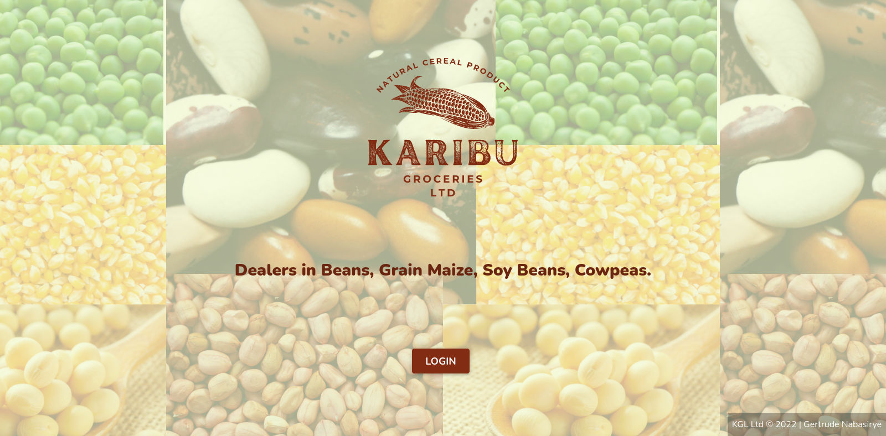

# Karibu Groceries Limited (KGL)

[

This is a readme file for the KGL project.

## Table of contents

- [Overview](#overview)
  - [The project](#the-project)
  - [Screenshot](#screenshot)
- [The process](#the-process)
  - [Built with](#built-with)
  - [Continued development](#continued-development)
  - [Useful resources](#useful-resources)
- [Collaborators](#collaborators)

## Overview

### The project

This project was undertaken as part of the Refactory Catalyst Program CAT011

Karibu groceries LTD is a wholesale produce distributor dealing in cereals with 2 Branches in
different locations. Over time all operations have been recorded in ruled black books. This has
prompted the owner to seek for a software solution.

KGL deals in Beans, Grain Maize, Cow peas, G-nuts, Soybeans. It gets produce from: -

- Individual dealers with produce not less than a tone (1000kg)
- Other companies that are willing to sell to KGL
- And also gets from its own two farms in **Maganjo** and **Matugga**
- KGL has a **manager** and **2 attendants** in each of the branches

### Screenshot

## The process

### Built with

- Pug
- NodeJS
- JavaScript
- CSS
- Mocha (tests)
- Coveralls (code coverage)
- Winston (logging)

### Continued development

Currently, the app is undergoing extensions to allow to CI/CD (Continuous Integration/Continuous Development or Deployment). This has prompted for research and implementation of packages such as Mocha and winston.

The tests carried out by Mocha and logging done by Winston are under development and refinement. Code coverage is yet to be fully implemented.

### Useful resources

- [Coveralls](https://coveralls.io/) - This is where the documentation for Coveralls, the tool for code coverage, is found.
- [Winston](https://www.npmjs.com/package/winston) - This is the npm page for the Winston package. It has example code that is very helpful.

## Collaborators

- Jonah Okot
  - GitHub - [jonahokot](https://github.com/jonahokot)
- Gertrude Nabasirye
  - GitHub - [TrudyCyns](https://github.com/TrudyCyns)
